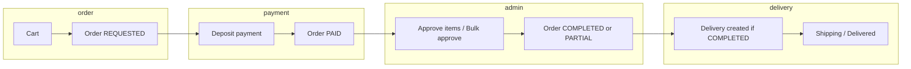

# INOUT 백엔드 코드베이스 개요

## 문서 목적

신규 투입 개발자가 **도메인 경계**, **주요 비즈니스 흐름**, **예외·응답 규약**, **동시성(락) 설계**를 빠르게 이해할 수 있도록 정리한 README 수준의 요약입니다.

---

## 1. 모듈·기능별 아키텍처 요약 (Feature Summary)

### 1.1 전체 구조

- **형태**: Spring Boot 기반 **단일 애플리케이션 모듈** (`com.jstudy.inout` 하위 패키지로 도메인 분리).
- **공통 계층**: `common` — 인증·JWT·보안·전역 예외·공통 DTO·메일 등 횡단 관심사.
- **도메인 패키지(업무)**: `order`, `payment`, `stock`, `delivery`, `inquiry`, `dashboard` 등.

### 1.2 도메인별 역할

| 도메인 | 패키지 | 핵심 역할 |
|--------|--------|-----------|
| **인증(Auth)** | `common.auth` | JWT 기반 Stateless 인증, 로그인·리프레시·회원 API, `CustomUserDetails` 등 |
| **주문(Order)** | `order` | 장바구니(`Cart*`) → 발주 요청(`OrderRequest`, `OrderDetail`) → 상태 전이, 관리자 처리·일괄 승인 |
| **결제(Payment)** | `payment` | 예치금(`DepositAccount`)으로 주문 대금 결제(`PaymentService`), 충전·환불(`DepositService`) |
| **재고(Stock)** | `stock` | 상품(`Item`)·입고/사용 이력, 직원/관리자용 재고 API |
| **배송(Delivery)** | `delivery` | 발주 완료 후 배송 엔티티 생성, 운송장·상태 전이(준비 → 배송 중 → 완료) |
| **문의(Inquiry)** | `inquiry` | 문의·댓글 엔티티 및 서비스 (API 노출 범위는 아래 기술 부채 참고) |
| **대시보드** | `dashboard` | 집계·현황 API (`DashboardController` + `ResponseResult`) |

### 1.3 대표 비즈니스 흐름 (발주 ~ 배송)

1. **직원**: 장바구니에 담기 → 발주 미리보기 → `OrderEmpService.submitOrderRequest`로 `OrderRequest` 생성, 상태 **`REQUESTED`(미결제)**. 이때 **수령인·연락처·주소 스냅샷**이 주문에 저장됨(배송 생성 시 재사용).
2. **직원**: `PaymentService.processDepositPayment`에서 주문 **`findByIdForUpdate`**로 잠금 후, 예치금 계좌 **`findByUserIdForUpdate`**로 잠금 → 차감·이력 → 주문 상태 **`PAID`**.
3. **관리자**
   - **상세 항목별 처리**: `OrderAdmService.processOrderItems` — 주문 **`findByIdForUpdate`**, 승인 시 품목별 **`ItemRepository.findByIdWithLock`**로 재고 차감. 전부 처리되면 **`COMPLETED`**, 일부 미처리면 **`PARTIAL`**.
   - **일괄 승인**: `OrderAdmService.bulkApproveOrders` → 주문 건별 **`OrderApprovalTxService.processSingleOrderApproval`** (`REQUIRES_NEW` 트랜잭션). 내부에서 주문 **`findByIdForUpdateWithDetails`**, 재고는 동일하게 **`findByIdWithLock`**.
4. **배송**: 주문이 **`COMPLETED`**가 되는 시점에 `DeliveryService.createDeliveryIfAbsentForCompletedOrder`가 호출되어 **멱등적으로** `Delivery` 1건 생성(이미 있으면 스킵). 스냅샷이 비어 있으면 `InoutException`으로 실패 처리.
5. **관리자**: 배송 시작·완료 시 `DeliveryRepository.findByOrderIdForUpdate`로 **배송 행 잠금** 후 상태 전이.

### 1.4 도메인 간 연관·의존성

- **Order → Payment**: `PaymentService`가 `OrderRequestRepository`에 의존. 결제 시 **주문 행 비관적 락**으로 이중 결제·상태 경쟁 완화.
- **Order → Stock**: 승인 경로에서 `Item` 재고 차감 + `StockUsageHistory` 기록. 재고 부족은 `NotEnoughStockException`(`InoutException` 하위)으로 표현.
- **Order → Delivery**: `OrderAdmService`와 `OrderApprovalTxService` 모두 완료 시 `DeliveryService` 호출 — **두 갈래 승인 플로우가 동일한 배송 생성 규약**을 공유.
- **Order → Mail**: 처리 후 `MailComponent.sendOrderStateEmail` 등으로 알림(비동기 설정 `@EnableAsync` 존재).
- **Delivery → Auth**: 배송 상태 변경 시 `UserRepository`로 사용자 조회 후 역할명으로 관리자 여부 검증.
- **Inquiry**: 엔티티·서비스·댓글 컨트롤러는 있으나, **문의 본체 CRUD용 컨트롤러는 현재 패키지 스캔 범위에서 확인되지 않음**(아래 품질 절 참고).

---

## 2. 코드 품질 및 일관성 검토 (Code Quality Check)

### 2.1 네이밍·패키지

- **장점**: `*Controller` / `*Service` / `*Repository` / `entity` / `dto` 관례가 대체로 일관됨. 관리자·직원 구분에 `Adm` / `Emp` 접두가 쓰임.
- **주의**: URL·역할 문자열 혼용(`ADMIN` vs `ROLE_ADMIN` 등)은 `DeliveryService.validateAdminUser`처럼 **양쪽을 허용하는 방어 코드**로 보완되어 있으나, **역할 모델 전역 규약**을 문서화하면 유지보수에 유리함.

### 2.2 전역 예외 처리 (`GlobalExceptionHandler`, `InoutException`)

- **`InoutException`**: HTTP 성격에 가까운 `errorCode` + 비즈니스용 `resultCode`를 함께 둘 수 있음.
- **`GlobalExceptionHandler`**: `InoutException`, 검증 오류, 인증 관련, 낙관적 락 충돌(`ObjectOptimisticLockingFailureException` → 409), 최상위 `Exception` 등을 처리.
- **`NotEnoughStockException`**: `InoutException` 상속 → 동일 핸들러로 응답됨(일괄 승인에서는 별도 catch로 비즈니스 분기).

**개선·부채**

1. **`DepositService.getAccountForUpdate`**: 계좌 없을 때 `IllegalArgumentException` — 전역 핸들러에 전용 처리가 없으면 **500으로 떨어질 수 있음**. 도메인 예외(`InoutException`)로 통일하는 편이 응답 규격과 로깅에 유리함.
2. **보안 필터 체인 밖 JSON**: `CustomAuthenticationEntryPoint`, `CustomAccessDeniedHandler`가 `ObjectMapper`로 **`ResponseMessage`를 직접 직렬화**. REST 컨트롤러는 `ResponseResult` → `ResponseMessage`로 맞추므로, **클라이언트 입장에서는 성공/실패 래핑 구조는 같지만 생성 경로가 이원화**되어 있음(추후 한 팩토리/빌더로 통일 검토).
3. **`UserController`**: 일부 구간에서 수동 `try/catch`와 `ResponseResult.fail` 직접 호출이 많아, **서비스에서 `InoutException`만 던지고 컨트롤러는 얇게** 가는 다른 모듈과 톤이 다름.

### 2.3 공통 응답 (`ResponseResult` / `ResponseMessage`)

- **컨트롤러**: 조사한 범위에서 주요 API는 `ResponseResult.success` / `fail` 사용이 **대부분 일관**됨(Order, Stock, Payment, Delivery, Auth 일부, Dashboard 등).
- **본문 구조**: `ResponseMessage`의 `header`(result, resultCode, message, status) + `body` 패턴이 표준으로 자리 잡음.
- **예외**: `GlobalExceptionHandler`의 `NoResourceFoundException`은 **본문 없이 404**만 반환 — SPA·API 혼합 시 클라이언트가 에러 포맷을 분기해야 함.

### 2.4 기술 부채·구조적 이슈 요약

| 항목 | 설명 |
|------|------|
| **이중 승인 플로우** | `processOrderItems`(라인 단위)와 `bulkApprove` + `OrderApprovalTxService`(주문 단위 일괄)가 **재고·배송·메일**을 각각 구현. 동작은 맞춰져 있으나 **중복 로직·정책 변경 시 이중 수정** 위험. |
| **Inquiry 본문 API** | `InquiryService`는 존재하나 **진입용 `InquiryController`가 검색되지 않음** — 기능 미완성 또는 다른 경로 노출 가능성. |
| **관리자 입고 `receiveStock`** | `StockAdmService.receiveStock`은 `findById`만 사용 — **고동시 입고와 출고/승인이 겹칠 때** `adjustStock`·직원 사용·승인과 **락 정책이 비대칭**(아래 3절). |
| **엑셀·집계** | `OrderAdmService`에 Apache POI 의존, 이력 페이징은 메모리 합산 등 — **데이터 규모 커지면 성능 이슈** 가능(코멘트로도 개선 여지 언급됨). |

---

## 3. 다음 스텝(기술 고도화) 준비도 — 비관적 락·동시성 관점

### 3.1 이미 잘 갖춘 부분

- **`Item`**: `@Version`(낙관적) + `findByIdWithLock`(비관적 쓰기) **병행** 설계가 엔티티 주석과 코드에 반영됨.
- **발주 승인·직원 재고 사용·재고 실사 조정**: `findByIdWithLock`으로 **재고 변경 직렬화**가 이미 적용됨.
- **주문·결제**: `OrderRequestRepository.findByIdForUpdate` / `findByIdForUpdateWithDetails`, 예치금 `findByUserIdForUpdate`로 **상태 전이·잔액 경쟁** 완화.
- **배송 상태 변경**: `findByOrderIdForUpdate`로 **동시 배송 처리**에 대비.
- **일괄 승인**: `REQUIRES_NEW`로 **부분 실패 격리** + 재고 부족 시 자동 반려 등 운영 친화적 패턴.

### 3.2 아키텍처 관점 평가 (비관적 락 “도입”이 아니라 “확장”에 가까움)

- **결론**: 재고 모듈은 **“락을 넣기 좋게” 이미 분리된 편**입니다. 재고 변경은 `Item` 도메인 메서드(`addStock` / `removeStock`)와 **전용 리포지토리 락 쿼리**에 모이고, 주문·결제·배송은 각자 **자신의 애그리거트 루트 행**을 잠그는 식으로 **경계가 비교적 명확**합니다.
- **다음 고도화 시 권장**:
  - **모든 재고 증가 경로**(특히 `receiveStock`)에 **동일한 락 전략** 적용 여부 검토.
  - **락 순서**(주문 → 품목 여러 개 등) **데드락 방지 규약**(항상 `itemId` 오름차순 등) 문서화.
  - 장기적으로는 **도메인 이벤트** 또는 **명시적 애플리케이션 서비스**(예: `StockLedgerService`)로 출고/입고·승인 경로를 한곳에 모으면 이중 승인 플로우 부담이 줄어듦.

### 3.3 트랜잭션·락과의 정합성

- `OrderApprovalTxService`는 `REQUIRES_NEW`로 **주문 단위 트랜잭션**을 나누고, 그 안에서 주문·품목 락을 획득 — **일괄 처리와 장시간 락** 사이의 트레이드오프는 모니터링 대상이 될 수 있으나, 설계 의도는 분명함.

---

## 한눈에 보는 체크리스트 (신규 온보딩용)

1. **API 응답**: 대부분 `ResponseResult` → `ResponseMessage`; 인증/권한 거부는 Security 핸들러 JSON 경로도 알고 있을 것.
2. **발주 상태**: `REQUESTED` → `PAID` → (`PARTIAL` 가능) → `COMPLETED` / `REJECTED` / `CANCELLED` — 관리자 처리 전 **`PAID` 여부** 검증 존재.
3. **동시성**: 재고 차감·주요 조정·결제·배송 상태는 **비관적 락 중심**; `Item`·`DepositAccount`는 **`@Version` 보조** 가능.
4. **배송**: `COMPLETED` 직후 멱등 생성; 스냅샷 필수.
5. **정리할 부채**: `DepositService` 예외 타입, Inquiry 본 API 노출, 입고 락 정책, 승인 로직 이원화.
